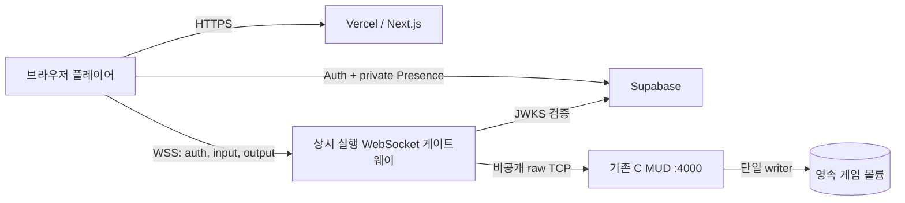

# 무한대전 웹 MUD 아키텍처 및 실행 계획

> 2026-09-08: 현재 기준은 [Go 서버 전환 계획](../porting-research/go-server-execution-plan.md)이다.
> 아래는 과거 아키텍처·배포 기록이다. 새 게임 런타임은 Go이며 C/Rust 서버 확장을 지시하지 않는다.

> 이 문서의 Vercel/managed Supabase 초기안은 보존된 조사 기록이다. 현재
> 실행안은 self-hosted Supabase Docker 구성 요소(Postgres/Auth/PostgREST/
> Realtime)와 Kubernetes Helm 배포이며, identity·저장 권위와 단계별 계획은
> [MUD identity·저장 구조 리팩터링](game-identity-refactor.md)이 기준이다.

작성일: 2026-09-01  
대상: 무한대전 운영·개발팀  
상태: MVP 구현·testnet-1xp 검증 배포 완료

## 결론

구현할 수 있다. 다만 xterm.js, Supabase, Vercel만으로 기존 C MUD의 상시 실행 게임 루프를 대체하면 안 된다.

MVP는 다음 경계를 사용한다.

- Vercel: Next.js 웹 클라이언트와 정적 자산
- Supabase: 브라우저 사용자 인증, 프로필, RLS, 선택적 접속자 Presence
- 상시 실행 런타임: WebSocket 게이트웨이와 기존 C MUD 단일 프로세스
- xterm.js: 브라우저의 UTF-8/ANSI 터미널 표현과 키 입력
- 영속 볼륨: 기존 방·플레이어·게시판·로그 파일

Vercel은 2026년 6월부터 Fluid Compute 기반 WebSocket과 컨테이너 배포를 베타로 제공하지만, 연결은 함수 인스턴스와 최대 실행 시간에 묶이고 인스턴스 간 상태는 외부 저장소가 필요하다. 기존 MUD는 단일 프로세스의 메모리 세계와 쓰기 가능한 파일시스템을 전제로 하므로, 이 베타를 권위 서버로 쓰지 않는다. [Vercel WebSocket 안내](https://vercel.com/kb/guide/do-vercel-serverless-functions-support-websocket-connections), [Vercel 30분 함수 베타](https://vercel.com/changelog/vercel-functions-can-now-run-up-to-30-minutes), [Vercel 컨테이너 제약](https://vercel.com/kb/guide/docker-on-vercel-vs-render)

## 시스템 경계



게임 명령의 권위는 항상 `브라우저 → 게이트웨이 → C MUD` 경로에 있다. Supabase Realtime은 접속자 수 같은 보조 UI에만 사용하고 전투, 이동, NPC, 타이머의 권위 소스로 사용하지 않는다.

## 선택지 비교

| 선택지 | 장점 | 결정적 약점 | 판단 |
|---|---|---|---|
| Vercel UI + Supabase Realtime만 사용 | 운영 요소가 적음 | 권위 게임 루프와 기존 TCP 엔진이 없음 | 제외 |
| Vercel UI + 상시 게이트웨이/C MUD + Supabase | 기존 게임을 보존하며 웹·인증을 현대화 | 별도 런타임과 볼륨 운영 필요 | 채택 |
| Vercel WebSocket/컨테이너 함수 + Supabase | 한 배포에서 프로토타입 가능 | 베타, 수명 제한, 인스턴스 분리, 휘발성 로컬 상태 | 실험 전용 |
| C 엔진을 Supabase/Postgres 중심으로 재작성 | 장기적으로 구조화 가능 | 게임 규칙·타이밍·바이너리 저장을 한 번에 이관하는 고위험 프로젝트 | 후속 단계 |

## 근거가 되는 현재 제약

### 기존 서버

- `src/io.c`는 75ms `select()` 루프에서 모든 연결, 명령, 출력, 월드 업데이트를 한 프로세스로 처리한다.
- 기본 포트는 4000이고 `INADDR_ANY`에 바인딩하므로 운영 환경에서 이 포트를 인터넷에 직접 노출하면 안 된다.
- UTF-8 입력과 코드포인트 단위 백스페이스는 이미 지원한다.
- 비밀번호 구간은 Telnet `WILL ECHO`/`WONT ECHO` 바이트를 사용하므로 게이트웨이가 이를 소비하고 브라우저 로컬 에코를 전환해야 한다.
- 플레이어와 방 저장은 로컬 파일 rename 기반이며, 단일 writer와 같은 ABI의 영속 볼륨을 요구한다.
- `SIGTERM` handler는 `sig_atomic_t` 종료 요청만 설정한다. 다음 75ms `select()` 루프에서 리스너를 닫고 기존 room/player 저장 경로를 실행한다. 저장 I/O 자체는 레거시 동기식이므로 운영 grace period는 최대 월드 저장 시간을 넘겨야 한다.

### Supabase

- Auth JWT와 Postgres RLS는 웹 사용자 신원·프로필에 적합하지만 게임 규칙 검증을 대신하지 않는다. [Supabase Auth](https://supabase.com/docs/guides/auth), [RLS](https://supabase.com/docs/guides/database/postgres/row-level-security)
- Broadcast는 게임 보조 이벤트에, Presence는 느리게 변하는 접속 상태에 적합하다. Presence를 키 입력이나 게임 tick에 사용하지 않는다. [Realtime 개요](https://supabase.com/docs/guides/realtime), [Presence](https://supabase.com/docs/guides/realtime/presence)
- Free/Pro 기본 Realtime 한도는 각각 동시 연결 200/500, 초당 메시지 100/500이다. 한 번의 fan-out도 수신자 수만큼 이벤트로 계산될 수 있어 전체 월드 상태를 매 tick 전송하면 안 된다. [Realtime 한도](https://supabase.com/docs/guides/realtime/limits), [Realtime 설정](https://supabase.com/docs/guides/realtime/settings)
- Edge Function WebSocket은 가능하지만 호스팅 환경의 wall-clock 상한은 Free 150초, 유료 400초다. `waitUntil`은 조기 종료를 줄일 뿐 상한을 연장하지 않는다. [WebSocket 처리](https://supabase.com/docs/guides/functions/websockets), [Edge Function 한도](https://supabase.com/docs/guides/functions/limits), [WebSocket 종료 진단](https://supabase.com/docs/guides/troubleshooting/edge-functions-worker-timeouts-and-websocket-drops)

### xterm.js

- xterm.js는 터미널 에뮬레이터이며 셸이나 서버가 아니다. `onData`와 `write`를 실제 프로세스/프로토콜에 연결해야 한다. [xterm.js 저장소](https://github.com/xtermjs/xterm.js/)
- TCP 출력은 UTF-8 코드포인트 중간에서 나뉠 수 있으므로 게이트웨이에서 텍스트로 임의 디코딩하지 않고 WebSocket binary frame으로 전달한다. xterm.js는 `Uint8Array`를 UTF-8 stream으로 처리한다. [xterm.js 인코딩](https://xtermjs.org/docs/guides/encoding/)
- 터미널 출력과 링크, 제목, parser hook 데이터는 신뢰하지 않는다. DOM `innerHTML`로 옮기지 않고 WSS, origin 검사, 명시적 인증을 적용한다. [xterm.js 보안](https://xtermjs.org/docs/guides/security/)

## MVP 프로토콜

### 브라우저 → 게이트웨이

1. 브라우저는 `wss://.../ws`를 `muhan.v1` subprotocol로 연다.
2. 연결 직후 첫 text frame으로 `{"type":"auth","accessToken":"<Supabase JWT>","characterId":"<lowercase UUID>"}`를 보낸다. `characterId`는 선택자일 뿐 권한 증명이 아니다.
3. 인증 완료 뒤 키 입력은 UTF-8 binary frame으로 보낸다.
4. 연결 상태 확인은 제한된 control frame만 허용한다.

JWT를 URL query에 넣지 않는다. 게이트웨이는 Supabase JWKS로 signature, issuer, audience, expiration, subject를 검증한 뒤 service-only character lease RPC가 반환한 exact owner/active/canonical name도 확인한다. 이 둘 중 하나라도 실패하면 MUD TCP 연결을 만들지 않는다. 비대칭 signing key를 쓰지 않는 기존 프로젝트는 Auth `/user` 검증으로 제한적으로 폴백한다. [Supabase JWT 검증](https://supabase.com/docs/guides/auth/jwts)

### 게이트웨이 → 브라우저

- MUD 출력: binary frame
- 상태: `ready`, `reconnecting`, `closed`, `error`
- Telnet echo 제어: `{"type":"echo","enabled":false}` 형태의 text frame

게이트웨이는 Telnet 협상 바이트를 브라우저에 노출하지 않는다. 허용된 협상에는 답하고, 알 수 없는 옵션은 거절한다. WebSocket send queue가 상한을 넘으면 느린 소비자를 종료해 C 서버의 출력 경로를 막지 않는다.

## 보안 기준

- 운영에서는 WSS만 허용하고 정확한 origin allow-list를 적용한다.
- MUD TCP 4000은 게이트웨이 네트워크 내부에서만 열어 둔다.
- Supabase `service_role`/secret key는 브라우저 번들에 넣지 않는다.
- 연결 전 인증 제한 시간, frame 크기, 초당 입력 byte, 동시 연결 상한을 둔다.
- JWT 만료 시 연결을 닫고 최신 세션으로 재연결한다.
- Gateway는 C MUD에 JWT를 전달하지 않는다. DB lease와 server-side canonical name으로 15초 이하 HMAC admission line을 만든 뒤, C의 정확한 `MUD1 OK\n` ACK 전까지 game byte를 relay하지 않는다.
- 터미널 출력은 xterm.js에만 쓰며 DOM HTML로 변환하지 않는다.
- 프로덕션에서 인증 비활성화 모드는 시작 자체를 거부한다.
- 게이트웨이는 root가 아닌 전용 사용자로 실행한다.

## Supabase 데이터 범위

MVP에서 Supabase는 다음만 소유한다.

- `profiles`: Auth 사용자와 공개 닉네임/접속 메타데이터
- private `mud:lobby` Presence 권한
- 향후 사용할 세션·캐릭터 연결 스키마의 확장 지점

레거시 캐릭터 비밀번호와 저장 파일은 이번 단계에서 Supabase로 이동하지 않는다. 따라서 MVP에는 “Supabase 웹 로그인”과 “기존 게임 캐릭터 로그인” 두 관문이 존재한다. 이를 숨기거나 하나의 인증처럼 표현하지 않는다.

통합 로그인은 후속 단계에서 다음 중 하나를 별도 설계한다.

- C 서버가 짧은 수명의 게이트웨이 서명 login ticket을 검증
- 캐릭터 소유권을 Supabase user id에 한 번 연결하고 비밀번호 입력을 제거
- 플레이어 저장을 구조화 DB로 이관하면서 인증도 함께 통합

## UI 디자인 기준

대상은 기존 MUD를 기억하는 사용자와 처음 접하는 한국어 플레이어이고, 화면의 단일 임무는 “인증 후 텍스트 세계에 안정적으로 입장”하는 것이다.

- 색: `먹빛 #081018`, `심연 #05090D`, `황동 #D7AE61`, `옥색 #75BDA7`, `장부색 #D8D4C4`, `경고 주홍 #D96B59`
- 서체: 터미널은 시스템 CJK monospace stack, 제목은 한국어 명조/serif stack, 상태·계기판은 condensed sans stack
- 레이아웃: 데스크톱은 얇은 월드 계기판 + 넓은 터미널, 모바일은 터미널 + 고정 명령 입력줄
- 시그니처: 현재 연결 상태와 접속자 수를 장식용 badge가 아니라 “성문 개방 상태”라는 하나의 세로 계기판으로 표현
- 동작: 재접속 한 번만 단계적으로 보여 주고, 나머지 모션은 최소화하며 `prefers-reduced-motion`을 존중

## 구현 단위와 소유권

```text
web/                       Next.js + Supabase Auth/Presence + xterm.js
services/gateway/          WSS ↔ raw TCP, JWT 검증, Telnet parser, 제한/health
supabase/migrations/       profiles 및 private Presence RLS
docker/                    C MUD와 게이트웨이 런타임 이미지
compose.yaml               로컬 통합 실행
docs/web-mud/              설계, 배포, 운영 문서
```

## 단계별 실행 계획

### 1. 기반과 서버 경계

- pnpm workspace와 공통 명령을 만든다.
- 게이트웨이의 설정 검증, health endpoint, JWT 검증, origin 정책을 구현한다.
- byte-safe TCP relay와 Telnet echo parser를 구현한다.
- parser, 인증 실패, frame 제한, 실제 relay에 대한 자동 테스트를 만든다.

완료 조건: 인증되지 않은 WebSocket은 MUD에 연결되지 않고, 테스트 MUD의 분할 UTF-8·Telnet 제어·CRLF 출력이 브라우저 프로토콜로 보존된다.

### 2. 웹 클라이언트

- Supabase email/password 인증과 명시적인 계정 상태를 구현한다.
- xterm.js + fit addon을 로드하고 resize·local echo·비밀번호 no-echo를 처리한다.
- 재접속 backoff, JWT 갱신, 연결/종료 이유를 사용자에게 보여 준다.
- private `mud:lobby` Presence로 보조 접속자 수를 표시한다.
- 모바일에는 IME 친화적인 별도 명령 입력줄을 제공한다.

완료 조건: 로그인한 사용자가 WSS를 통해 실제 C MUD welcome/login 흐름을 보고 한글 명령을 입력할 수 있다.

### 3. Supabase와 영속 런타임

- `profiles` trigger/RLS와 private Presence policy migration을 만든다.
- C 서버를 foreground로 빌드하는 컨테이너와 게이트웨이 컨테이너를 만든다.
- 로컬 compose에서는 C 포트를 host에 publish하지 않고 gateway만 노출한다.
- `/home/muhan`의 mutable 경로와 백업/복구 절차를 문서화한다.

완료 조건: disposable volume에서 기존 TCP smoke가 통과하고, 게이트웨이 경유 통합 smoke가 통과한다.

### 4. 배포 준비

- Vercel에 `web/` root와 공개 환경변수를 설정한다.
- Supabase migration을 적용하고 Realtime public access를 끈다.
- 상시 런타임은 persistent disk와 private service network를 제공하는 호스트에 배포한다.
- WSS origin을 Vercel production/preview 도메인으로 제한한다.
- 강제 종료, 재시작, 느린 브라우저, 토큰 만료를 canary로 검증한다.

완료 조건: 외부에서는 HTTPS/WSS만 도달 가능하고, 서버 재시작 뒤에도 기존 플레이어 파일이 유지된다.

## 이번 Goal의 완료 기준

- 조사 결론과 제약이 이 문서에 근거 링크와 함께 고정되어 있다.
- Vercel 배포 가능한 web 앱, 실행 가능한 gateway, Supabase migration, 로컬 runtime 구성이 저장소에 존재한다.
- TypeScript 검사, web build, gateway 단위/통합 테스트, 기존 C smoke 중 실행 가능한 검증이 통과한다.
- 사용자 수정 `objmon/Celduin_sign`은 그대로 보존된다.
- 실제 Supabase/Vercel 프로젝트 연결에 필요한 값과 수동 단계가 문서화된다.

로컬 검증 결과와 외부 계정이 필요한 미실행 항목은 `verification.md`에 분리해 기록한다.

## 후속 단계

- legacy ident helper 제거
- Supabase user ↔ 레거시 캐릭터 소유권 연결 및 통합 로그인
- player/room 바이너리 파일의 버전 있는 스냅샷·Postgres 이관
- 구조화 게임 이벤트와 reconnect resume token
- 다중 월드 샤딩 또는 권위 서버 재작성
